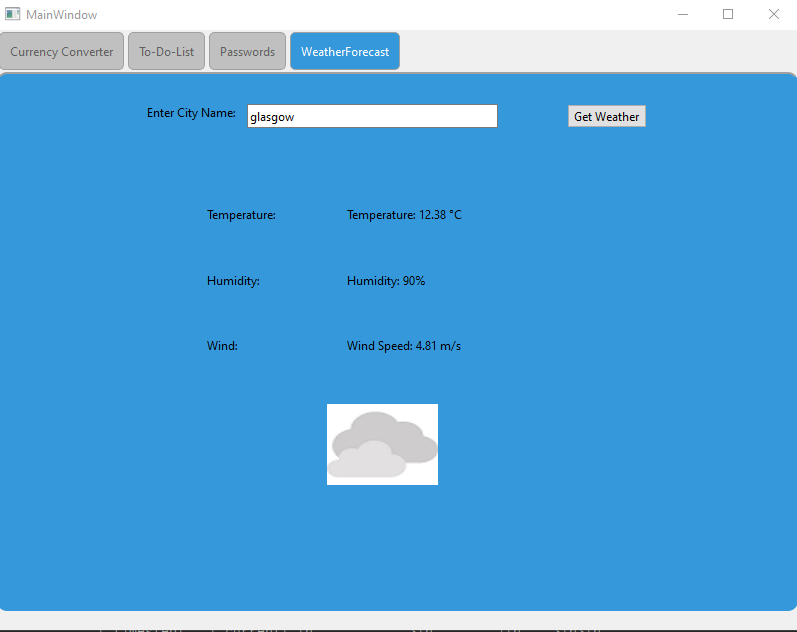

# Multi-Functional Qt Application

## Overview

This Qt application combines multiple useful tools into one cohesive app, showcasing the flexibility of Qt for creating desktop applications with a modern GUI. The app includes four main features: a Currency Converter, a To-Do List, a Password Manager, and a Weather Forecast tool.

### Key Features:
- **Currency Converter**: Converts between different currencies with real-time exchange rates.
- **To-Do List**: A simple task management feature allowing users to add, edit, and mark tasks as complete.
- **Password Manager**: Stores passwords securely, helping users keep track of login credentials.
- **Weather Forecast**: Provides real-time weather forecasts for different locations.

## App Features

1. **Currency Converter**: 
   - Easily convert between different currencies using live exchange rates.
   - Simple input and output fields for entering amounts and selecting currencies.
   
   

2. **To-Do List**: 
   - Add tasks to a list with options to edit or delete them.
   - Mark tasks as complete to keep track of progress.
   
   

3. **Password Manager**: 
   - Securely store your passwords in the app's password manager.
   - Easily access stored credentials while keeping them safe from unauthorized access.
   
   

4. **Weather Forecast**: 
   - Get real-time weather information for various locations, including temperature, wind speed, and other relevant data.
   
   

## Technologies Used
- **C++**: Core logic of the application.
- **Qt Framework**: Used for the user interface and functionality.
- **API Integrations**: For retrieving currency exchange rates and weather data.
